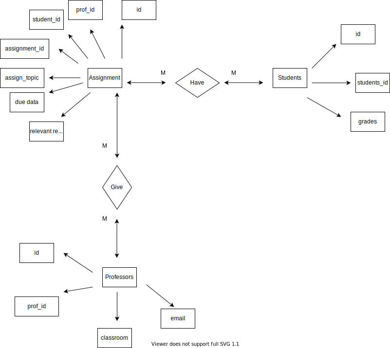

# Data Normalization and Entity-Relationship Diagramming

The data in the exercise looks like this:

| assignment_id | student_id | due_date | professor | assignment_topic                | classroom | grade | relevant_reading    | professor_email   |
| :------------ | :--------- | :------- | :-------- | :------------------------------ | :-------- | :---- | :------------------ | :---------------- |
| 1             | 1          | 23.02.21 | Melvin    | Data normalization              | WWH 101   | 80    | Deumlich Chapter 3  | l.melvin@foo.edu  |
| 2             | 7          | 18.11.21 | Logston   | Single table queries            | 60FA 314  | 25    | Dümmlers Chapter 11 | e.logston@foo.edu |
| 1             | 4          | 23.02.21 | Melvin    | Data normalization              | WWH 101   | 75    | Deumlich Chapter 3  | l.melvin@foo.edu  |
| 5             | 2          | 05.05.21 | Logston   | Python and pandas               | 60FA 314  | 92    | Dümmlers Chapter 14 | e.logston@foo.edu |
| 4             | 2          | 04.07.21 | Nevarez   | Spreadsheet aggregate functions | WWH 201   | 65    | Zehnder Page 87     | i.nevarez@foo.edu |
| ...           | ...        | ...      | ...       | ...                             | ...       | ...   | ...                 | ...               |

There are many problems with this data and as a result a record does not meet 4NF. A record does not satisfy the requirements of third normal form because: 
- Classroom, professor_email are dependent upon the professor name, with each professor having a different email and assigned classrooms
- Grades are dependent upon the student_id, with each student_id having a different grades.
- Due_date, assignment_topic, relevant_reading are dependent upon the assignment_id, with each assignment_id having a different data.

In order to make a record in fourth normal form, I made multiple tables and each of that had own id and data describing only table's entity. As a result I got these tables:

### Assignment Table

|    id       | assignment_id |  professor_id | student_id | due_date | assignment_topic                |relevant_reading    |
|:------------| :------------ | :---------    | :-------   | :--------| :------------------------------ |:------------------ |
|    1        | 1             | 1             | 1          | 23.02.21 | Data normalization              |Deumlich Chapter 3  |
|    2        | 2             | 2             | 7          | 18.11.21 | Single table queries            |Dümmlers Chapter 11 |
|    3        | 1             | 1             | 4          | 23.02.21 | Data normalization              |Deumlich Chapter 3  |
|    4        | 5             | 2             | 2          | 05.05.21 | Python and pandas               |Dümmlers Chapter 14 |
|    5        | 4             | 3             | 2          | 04.07.21 | Spreadsheet aggregate functions |Zehnder Page 87     |
|    ...      | ...           | ...           | ...        | ...      | ...                             | ...                |

### Professors Table

| student_id    |    grade   |
| :------------ | :--------- |
| 1             |      80    | 
| 2             |      25    | 
| 3             |      75    |
| 4             |      92    |
| 5             |      65    |
| ...           | ...        | 

### Students Table
| professor_id  | professor  |classroom | professor_email   |
| :------------ | :--------  |:-------- | :---------------- |
| 1             | Melvin     | WWH 101  | l.melvin@foo.edu  |
| 2             | Logston    | 60FA 314 | e.logston@foo.edu |
| 3             | Nevarez    | WWH 201  | i.nevarez@foo.edu |
| ...           | ...        | ...      | ...               |

Now, you can see that each column of data that was dependent on different fields like assignment_id, professor and student_id, I moved to different tables, so that those non-key fields are now dependent only on entity and describes only one entity. Tables are connected using their primary keys which are identical ids but for different tables (Primary keys can be seen in the ER-diagram below). Now, the data satisfy the requirements of third normal form and do not contain more than one independent multi-valued fact about an entity which makes it to meet requirements of fourth normal form.

Here is the ER-diagram that I got as a result in fourth normal form.
